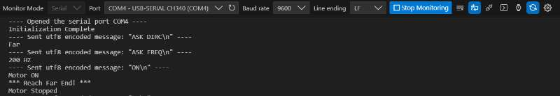
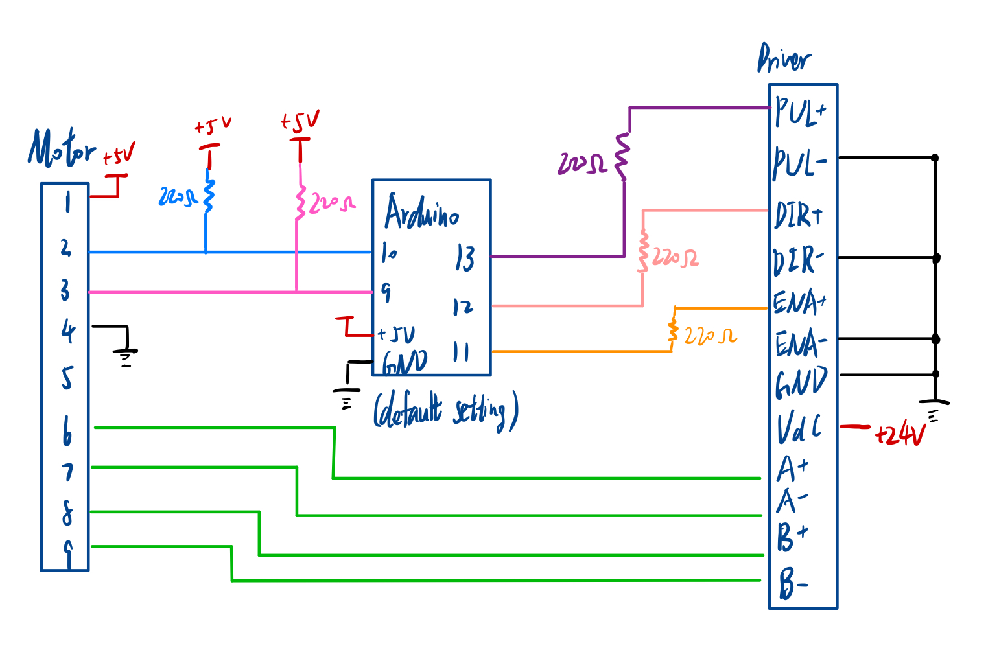

# MotorSerialControl.ino User Guide

This programm communiates the Arduino UNO using serial communication. Open the serial port (USB-SERIAL CH340) first before using it.

Set the Baud rate to 9600, use LF line ending (\n) with every command sent.



## System Connection


## SET command
Set the parameter of the motor
```
SET FREQ [frequency] 
Example: SET FREQ 200
```
Set the pulse frequency to drive the stepper motor, 200 Hz (4 mm/s) by default (Maximum freq: 600)
```
SET DIRC [FAR/NER] # Set the dirction. Far (the opposite side of the motor) by default
```

## ON/OFF command
Turn on / off the motor
```
ON [pulse number] 
Example: ON 200 # Move 4mm (50 pulse/mm)
Example: ON # Move to the end
```
Turn on the motor. It will stop after receiving the given number of pulses. Leave the pulse number blank to keep it running until it reaches the near/far end and stops automatically
```
OFF # Stop the motor
```
It should be noted that if the motor reaches the end, `ON` command will not be valid unless the direction is switched to the opposite side

## ASK command
Get the parameter of the motor
```
ASK FREQ # Return current frequency
ASK DIRC # Return current direction
```
